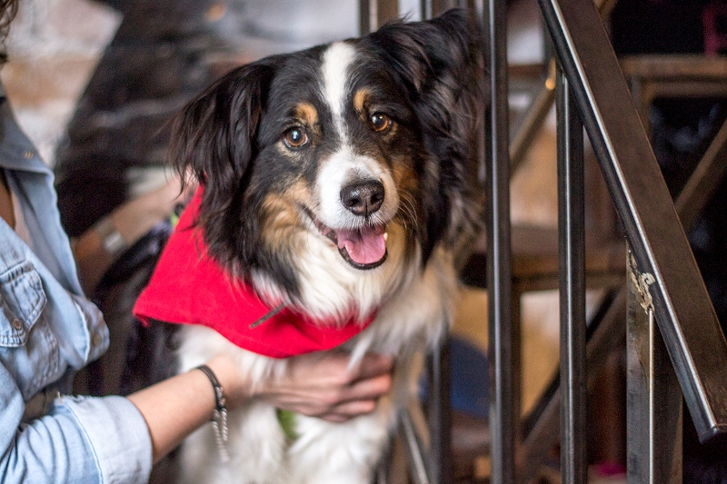

```{r setup, include=FALSE, warning=FALSE}
knitr::opts_chunk$set(error = FALSE)
ggplot2::theme_set(ggplot2::theme_classic())
```


## Wst&eogon;p

Schronisko dla Bezdomnych Zwierz&aogon;t w Warszawie, znane te&zdot; jako [Schronisko na Paluchu](https://napaluchu.waw.pl/) funkcjonuje od 2001 roku. Jego misj&aogon; jest ochrona bezdomnych zwierz&aogon;t, stwarzanie im drugiej szansy i bycie jedynie przystankiem na drodze mi&eogon;dzy domami. Na dzie&nacute; 30 kwietnia 2021 w schronisku znajdowa&lstrok;o si&eogon; 387 ps&oacute;w.

Celem projektu jest stworzenie algorytmu pozwalaj&aogon;cego na przewidywanie czasu, w jakim zostanie adoptowany pies po przyj&eogon;ciu do schroniska i odbyciu 15-dniowej kwarantanny. Wnioski mog&aogon; zosta&cacute; u&zdot;yte do zoptymalizowania og&lstrok;osze&nacute; adopcyjnych tak, aby pobyt danego psa w schronisku m&oacute;g&lstrok; by&cacute; jak najkr&oacute;tszy.

## Pozyskanie surowych danych

Dane u&zdot;yte do tego projektu zosta&lstrok;y pozyskane ze strony internetowej [Schroniska na Paluchu](https://napaluchu.waw.pl/) przy pomocy web scrapingu w j&eogon;zyku Python. Kod scrapera znajduje si&eogon; w pliku *np_scraper.ipynb*. Outputem tego kodu jest baza danych *na_paluchu.db*.

## Przygotowanie danych

#### Instalacja i &lstrok;adowanie bibliotek:

<p>**dplyr** - pozwala na manipulacj&eogon; danymi (na wierszach i kolumnach),</p>
<p>**RSQLite** - dzi&eogon;ki niej mo&zdot;na po&lstrok;&aogon;czy&cacute; si&eogon; z SQLite,</p>
<p>**stringr** - potrzebna do wykonywania operacji na ci&aogon;gach znak&oacute;w,</p>
<p>**reshape** - do zmiany struktury zbioru danych,</p>
<p>**ggplot2** - do wykonywania wykres&oacute;w,</p>
<p>**tidyr** - do formatowania i przekszta&lstrok;cania danych,</p>
<p>**gridExtra** - potrzebna do umieszczania grafiki (ggplot) obok siebie,</p>
<p>**rmdformats** - do wykorzystania gotowych motyw&oacute;w stron HTML,</p>
<p>**caret** - potrzebna ze wzgl&eogon;du na funkcje do modelowania i predykcji,</p>
<p>**naivebayes, RandomForest, xgboost, kerblab, e1071** - do wykorzystania konkretnych algorytm&oacute;w.</p>


```{r warning = FALSE, message = FALSE}
library(dplyr)
library(RSQLite)
library(stringr)
library(reshape)
library(ggplot2)
library(tidyr)
library(gridExtra)
library(rmdformats)
library(caret)
library(naivebayes)
library(randomForest)
library(xgboost)
library(kernlab)
library(e1071)		  
```

#### &Lstrok;&aogon;czenie si&eogon; z baz&aogon; danych *na_paluchu.db*

Dost&eogon;p do danych za pomoc&aogon; pakietu RSQLite
```{r include = FALSE}
wd
```
```{r echo = TRUE}
con <- dbConnect(drv=RSQLite::SQLite(), dbname="na_paluchu.db")
tables <- dbListTables(con)
animals <- dbGetQuery(conn=con, statement=paste("SELECT * FROM pets;", sep=","))
dbDisconnect(con)
```

#### Eksploracja surowych danych

Obiekt *animals* jest ramk&aogon; danych o wymiarach 20 010 wierszy na 12 kolumn. Wywo&lstrok;anie funkcji `str()` pokazuje te&zdot;, &zdot;e wszystkie warto&sacute;ci w kolumnach s&aogon; typu **character**. W zestawie danych nie brakuje &zdot;adnych warto&sacute;ci (*NA*).

```{r echo = TRUE}
str(animals)
sum(is.na(animals))
````

* numer - nieunikalny identyfikator psa w dokumentacji schroniska (istnieje kilka duplikat&oacute;w)
* imie - imi&eogon; psa nadane w schronisku
* w_typie_rasy - pies wykazuje cechy rasowe w wygl&aogon;dzie i zachowaniu, ale nie ma udokumentowanego pochodzenia
* wiek - wiek psa w momencie przyj&eogon;cia do schroniska (w miesi&aogon;cach lub latach)
* plec - samiec, samica lub nn
* waga - masa psa w momencie przyj&eogon;cia do schroniska (w kilogramach)
* status - "wydane" dla wszystkich wierszy, w dalszych etapach ta kolumna b&eogon;dzie pomini&eogon;ta
* data_przyjecia - data w formacie *yyyy-mm-dd*
* data_wydania - data w formacie *yyyy-mm-dd*
* miejsce_znalezienia - ulica lub/i miasto, ewentualnie sk&aogon;d pies znalaz&lstrok; si&eogon; w schronisku; w dalszym etapie obserwacje z warto&sacute;ci&aogon; "przepisana umowa" zostan&aogon; pomin&eogon;te
* boks - miejsce na terenie schroniska
* grupa - grupa na Facebooku, na kt&oacute;rej wystawione jest og&lstrok;oszenie adopcyjne

Kolumna *numer* posiada duplikaty, kt&oacute;re trzeba b&eogon;dzie usun&aogon;&cacute;:
```{r echo = TRUE}
print(animals %>%
        count(numer) %>%
        arrange(desc(n)) %>%
        head())
````

Kolumna *w_typie_rasy* posiada 156 unikalnych warto&sacute;ci:
```{r echo = TRUE}
length(unique(animals$w_typie_rasy))
````

Kolumna *plec* posiada nieznane warto&sacute;ci:
```{r echo = TRUE}
unique(animals$plec)
````

Kolumna *miejsce_znalezienia* posiada ponad 9 000 unikalnych warto&sacute;ci:
```{r echo = TRUE}
length(unique(animals$miejsce_znalezienia))
````

Kolumna *boks* ma ponad 2 000 unikalnych warto&sacute;ci:
```{r echo = TRUE}
length(unique(animals$boks))
````
Jako, &zdot;e nie jest znana zasada przydzielania ps&oacute;w do boksu, a tak&zdot;e znalezienie sp&oacute;jnego sposobu na pogrupowanie boks&oacute;w jest prawie niemo&zdot;liwe, w dalszych etapach ta kolumna zostanie pomini&eogon;ta.

#### Czyszczenie danych

Usuwanie duplikat&oacute;w z kolumny *numer*
```{r echo = TRUE}
animals <- animals[!(duplicated(animals$numer)), ]
````

Usuwanie warto&sacute;ci liczbowych z kolumny *imie*
```{r echo = TRUE}
animals$imie[str_detect(animals$imie, "[0-9]{1}")] <- 'brak'
````

Pogrupowanie unikalnych warto&sacute;ci z kolumny *w_typie_rasy* w 15 grup na podstawie [klasyfikacji Mi&eogon;dzynarodowej Federacji Kynologicznej](https://pl.wikipedia.org/wiki/Grupy_FCI) (zmienne kategoryczne na zmienne numeryczne):

* 1 - mieszaniec
* 2 - jamnik
* 3 - terier
* 4 - owczarek
* 5 - szpic/pies w typie pierwotnym
* 6 - aporter
* 7 - pies ozdobny/do towarzystwa
* 8 - p&lstrok;ochacz
* 9 - molos
* 10 - pinczer/sznaucer
* 11 - wy&zdot;e&lstrok;
* 12 - go&nacute;czy
* 13 - szwajcarski pies pasterski
* 14 - chart
* 15 - inny
```{r eval = TRUE}

animals <- animals %>%
  mutate(w_typie_rasy = tolower(w_typie_rasy)) 
#zmienna pomocnicza
w <- animals$w_typie_rasy

animals <- animals %>%
  mutate(rasa = ifelse(w %in% c("mieszaniec"), 1,
                       ifelse(w %in% c("jamnik"), 2,
                              ifelse(str_detect(w, "staff|ter+ier|highland|jack|pitbul|foks"), 3,
                                     ifelse(str_detect(w, "owczarek|collie|wilczak"), 4,
                                            ifelse(str_detect(w, "husky|malamut|akita|szpic|karelski|chow|shiba|.ajka|samojed"), 5,
                                                   ifelse(str_detect(w, "labrador|retriever|flat coat"), 6,
                                                          ifelse(str_detect(w, "peki.czyk|tzu|ratler|bulldog fra|pudel|malta|chih|king|grzywacz|biszon|mops"), 7,
                                                                 ifelse(str_detect(w, "spaniel"), 8,
                                                                        ifelse(str_detect(w, "bokser|rottweiler|bernardyn|molos|shar|cane|buldog|^dog|mastif|anatol|nowofund|leon|tosa"), 9,
                                                                               ifelse(str_detect(w, "sznaucer|pinczer|doberman"), 10,
                                                                                      ifelse(str_detect(w, "wy.e.|breton|seter|gordon"), 11,
                                                                                             ifelse(str_detect(w, "go.czy|posokowiec|ogar|basset|dalmaty|rhode|beagle"), 12,
                                                                                                    ifelse(str_detect(w, "berne.ski"), 13,
                                                                                                    ifelse(str_detect(w, "chart|wilczarz|greyh"), 14, 15))))))))))))))) %>%
  select(-w_typie_rasy)
````

Ujednolicenie warto&sacute;ci z kolumny *wiek* - zamiana lat na miesi&aogon;ce
```{r eval = TRUE}
animals <- animals %>%
  mutate(wiek_msc = as.numeric(str_extract(wiek, "[0-9]{1,2}"))) %>%
  mutate(wiek_m = ifelse(str_detect(wiek, "mies"), wiek_msc, wiek_msc * 12)) %>%
  select(-wiek, -wiek_msc)
````

Zamiana warto&sacute;ci z kolumny *plec* z kategorycznych na numeryczne:

* 0 - samiec
* 1 - samica
* 2 - nn
```{r eval = TRUE}
animals <- animals %>%
  mutate(plec2 = ifelse(plec == "samiec", 0, ifelse(plec == "samica", 1, 2))) %>%
  select(-plec)
````

Pomijanie jednostki w kolumnie *waga* i uzupe&lstrok;nianie warto&sacute;ci 0
```{r eval = TRUE}
animals <- animals %>%
  mutate(waga_2 = as.numeric(str_extract(waga, "[0-9]{1,2}"))) %>%
  select(-waga)

agg1 <- aggregate(waga_2 ~ rasa,  animals, 
                  median)
colnames(agg1) <- c("rasa","mediana")
animals <- animals %>% left_join(agg1, by = 'rasa')

animals <- animals %>%
  mutate(waga = ifelse(waga_2 == 0, as.numeric(mediana), waga_2)) %>%
  select(-waga_2) %>%
  select(-mediana)
````

Zamiana warto&sacute;ci z kolumn *data_przyjecia* i *data_wydania* na typ **date**, wyliczanie okresu pomi&aogon;dzy dwoma datami, usuwanie obserwacji z dat&aogon; wsteczn&aogon;
```{r eval = TRUE}
animals$data_przyjecia <- as.Date(animals$data_przyjecia, format = "%Y-%m-%d")
animals$data_wydania <- as.Date(animals$data_wydania, format = "%Y-%m-%d") 

animals <- animals %>%
  mutate(roznica = data_wydania - data_przyjecia) %>%
  filter(roznica > 0 | roznica == 0)
````

Tworzenie nowej kolumny *przedzial* na podstawie d&lstrok;ugo&sacute;ci okresu mi&eogon;dzy dat&aogon; przyj&eogon;cia do schroniska a dat&aogon; wydania:

* 1 - kwarantanna (15 dni po przyj&eogon;ciu do schroniska)
* 2 - do 1 miesi&aogon;ca (16-30 dni)
* 3 - do 3 miesi&aogon;cy (31-91 dni)
* 4 - do 6 miesi&aogon;cy (92-183 dni)
* 5 - do roku (184-365 dni)
* 6 - do 5 lat (366-1826 dni)
* 7 - powy&zdot;ej 5 lat
````{r warning = FALSE}
animals <- animals %>%
  mutate(przedzial = ifelse(between(roznica, 0, 15), 1,
                            ifelse(between(roznica, 16,30), 2,
                                   ifelse(between(roznica, 31, 91), 3,
                                          ifelse(between(roznica, 92, 183), 4,
                                                 ifelse(between(roznica, 184, 365), 5,
                                                        ifelse(between(roznica, 366, 1826), 6, 7))))))) %>%
  select(-roznica)
````

Pogrupowanie unikalnych warto&sacute;ci z kolumny *miejsce_znalezienia* w 14 grup (zmienne kategoryczne na zmienne numeryczne):

* 1 - zwrot z adopcji
* 2 - Schronisko Radysy
* 3 - Fundacja Sfora
* 4 - brak informacji
* 5 - podrzucony pod schronisko
* 6 - Warszawa
* 7 - Raszyn
* 8 - z innego schroniska
* 9 - Piaseczno
* 10 - G&oacute;ra Kalwaria
* 11 - &Lstrok;omianki
* 12 - powr&oacute;t z ucieczki
* 13 - po zmar&lstrok;ej osobie
* 14 - w&lstrok;a&sacute;ciciel w izbie wytrze&zacute;wie&nacute;

````{r eval = TRUE}
animals <- animals %>%
  filter(str_count(miejsce_znalezienia, "przepisanie") < 1)
#zmienna pomocnicza
m <- animals$miejsce_znalezienia

animals <- animals %>% 
  mutate(miejsce = ifelse(str_detect(m, "adopcji"), 1,
                          ifelse(str_detect(m, "schronisko radysy"), 2,
                                 ifelse(str_detect(m, "fundacja sfora"), 3,
                                        ifelse(str_detect(m, "brak|sm ,|pies od nas"), 4,
                                               ifelse(str_detect(m, "[pod|przed|w|okolice|teren|okolic|do]{1} schroni"), 5,
                                                      ifelse(str_detect(m, "na skraj|raszy.ska|krakowska|warszawa|bia.o..ka|warszawy|warszawa"), 6,
                                                             ifelse(str_detect(m, "raszyn"), 7,
                                                                    ifelse(str_detect(m, "przekazanie ze schro|innego sch"), 8,
                                                                           ifelse(str_detect(m, "piaseczno|z.otok.os|chylice|zalesie g|go.l.w|mieszk.w|pilawa|bobrowiec"), 9,
                                                                                  ifelse(str_detect(m, "kalwaria|lka dworska"), 10,
                                                                                         ifelse(str_detect(m, "omianki"), 11,
                                                                                                ifelse(str_detect(m, "ucieczk"), 12,
                                                                                                       ifelse(str_detect(m, "zmar.ej"), 13,
                                                                                                              ifelse(str_detect(m, "sodon"), 14, 6))))))))))))))) %>%
  select(-miejsce_znalezienia)
````

Zamiana warto&sacute;ci z kolumny *grupa* z kategorycznych na numeryczne:

* 1 - brak
* 2 - [A](https://www.facebook.com/paluch.grupa.a/)
* 3 - [Asy](https://www.facebook.com/asoweadopcje/)
* 4 - [Fundacja](https://www.facebook.com/fundacjaprzyjacielepalucha/)
* 5 - [G1](https://www.facebook.com/wybieramkundelka/)
* 6 - [G11](https://www.facebook.com/11psichmarzen/)
* 7 - [G13](https://www.facebook.com/PSYjacieleGr13/)
* 8 - [G2](https://www.facebook.com/PokochajBezdomniaka/)
* 9 - [G4](https://www.facebook.com/odmienswiat/)
* 10 - [G6](https://www.facebook.com/psiakina6/)
* 11 - [G9](https://www.facebook.com/DDD.psie.adopcje/)
* 12 - [Geriatria](https://www.facebook.com/napaluchugeriatria/)
* 13 - [Grupa 7](https://www.facebook.com/Grupa7SchroniskoNaPaluchu/)
* 14 - [Kojoty](https://www.facebook.com/4%C5%81apy-do-adopcji-107079024418262)
* 15 - [MAKAK](https://www.facebook.com/kundelkinawydaniu/)
* 16 - [Pomaranczowi](https://www.facebook.com/pomaranczowi/)
* 17 - [Poziomki](https://www.facebook.com/PoziomkiZPalucha/)
* 18 - [Psie Przedszkole](https://www.facebook.com/pokochajmalucha)
* 19 - [Psubraty](https://www.facebook.com/GrupaPsubraty/)
* 20 - [Sfora](https://www.facebook.com/schroniskonapaluchu.grupasfora/)
* 21 - [TTB](https://www.facebook.com/Amstaffy-z-Palucha-1633315423594260/)
* 22 - [Wilki](https://www.facebook.com/wilkizpalucha/)
* 23 - [Zolte Boksy](https://www.facebook.com/grupabehawioralna/)

````{r eval = TRUE}
grupy <- data.frame(c("brak",	"A",	"Asy",	"Fundacja",	"G1",	"G11",	"G13",	"G2",	"G4",	"G6",	"G9",	"Geriatria",	"Grupa 7",	"Kojoty",	"MAKAK",	"Pomaranczowi",	"Poziomki",	"Psie Przedszkole",	"Psubraty",	"Sfora",	"TTB",	"Wilki",	"Zolte Boksy"),
                    c(1,	2,	3,	4,	5,	6,	7,	8,	9,	10,	11,	12,	13,	14,	15,	16,	17,	18,	19,	20,	21,	22,	23))
colnames(grupy) <- c("grupa","nr_grupy")

animals <- animals %>% left_join(grupy, by = 'grupa')
replc <- animals$grupa
replc[is.na(replc)] <- 'brak'
````

Usuwanie niepotrzebnych kolumn, zmiana nazw kolumn na bardziej czytelne
```{r eval = TRUE}
animals <- animals %>% 
  select(-status, -boks, -grupa) %>% 
  dplyr::rename(wiek = wiek_m, plec = plec2, grupa = nr_grupy) %>% 
  relocate(przedzial, .after  = grupa)
````

## Analiza danych

Po powy&zdot;szych przekszta&lstrok;ceniach obiekt *animals* prezentuje si&eogon; nast&eogon;puj&aogon;co:
````{r echo = TRUE}
str(animals)
summary(animals)
````

Ramka danych *animals* posiada teraz 19 951 wierszy i 11 kolumn. Dwie kolumny maj&aogon; typ **date**, dwie kolumny - typ tekstowy, reszta to dane numeryczne. 

#### Macierz i mapa korelacji

Tworzenie mapy korelacji za pomoc&aogon; bibliotek `dplyr, reshape, ggplot2` - aby sprawdzi&cacute; czy s&aogon; zale&zdot;no&sacute;ci liniowe mi&eogon;dzy zmiennymi numerycznymi
````{r echo = TRUE}
M1 <- animals %>% 
  select(-numer, -imie, -data_przyjecia, -data_wydania, -grupa) %>%
  relocate(przedzial, after = miejsce)
M2 <- round(cor(M1), 2)

#mapa korelacji
melted_M2 <- melt(M2)

ggplot(data = melted_M2, aes(x = X1, y = X2, fill = value)) +
  geom_tile(color = "white")+
  scale_fill_gradient2(low = "brown3", high = "dodgerblue4", mid = "white", 
                       midpoint = 0, limit = c(-1,1), space = "Lab", 
                       name="Korelacja liniowa\nPearsona") +
  theme_minimal() + 
  theme(axis.text.x = element_text(angle = 45, vjust = 1, 
                                   size = 12, hjust = 1)) +
  coord_fixed() + xlab("") + ylab("")
````
Z mapy korelacji wynika, &zdot;e najwi&eogon;kszy wp&lstrok;yw na szybko&sacute;&cacute; adopcji mo&zdot;e mie&cacute; wiek psa (w por&oacute;wnaniu z innymi badanymi czynnikami).

#### Wybrane miary dla zmiennej *imie*

Najpopularniejszymi imionami nadawanymi w Schronisku na Paluchu s&aogon; Luna (dla samic) i Bruno (dla samc&oacute;w).
````{r eval = TRUE, message = FALSE}
top_imie_f <- animals %>% 
  filter(plec == 1) %>% 
  count(imie) %>%
  arrange(desc(n)) %>% 
  filter(imie != "brak") %>% 
  top_n(10)

top_imie_m <- animals %>% 
  filter(plec == 0) %>% 
  count(imie) %>%
  arrange(desc(n)) %>% 
  filter(imie != "brak") %>% 
  top_n(10)

plot_f <- ggplot(top_imie_f, aes(x = reorder(imie, desc(-n)), y = n, main="Najpopularniejsze imie dla samic")) +
  geom_bar(stat = "identity", fill = "azure2") +
  coord_flip() + scale_y_continuous(name="") +
  scale_x_discrete(name="Imie samicy") +
  theme(axis.text.x = element_text(face="bold", color="darkslateblue",
                                   size=8, angle=0),
        axis.text.y = element_text(face="bold", color="darkslateblue",
                                   size=8, angle=0)) +
  geom_text(aes(label = n, hjust = 1.5))
plot_m <- ggplot(top_imie_m, aes(x = reorder(imie, desc(-n)), y = n, main="Najpopularniejsze imie dla samcow")) +
  geom_bar(stat = "identity", fill = "azure2") +
  coord_flip() + scale_y_continuous(name="") +
  scale_x_discrete(name="Imie samca") +
  theme(axis.text.x = element_text(face="bold", color="darkslateblue",
                                   size=8, angle=0),
        axis.text.y = element_text(face="bold", color="darkslateblue",
                                   size=8, angle=0)) +
  geom_text(aes(label = n, hjust = 1.5))
grid.arrange(plot_f, plot_m, ncol = 2)
````

#### Trend i sezonowo&sacute;&cacute; 

Przygotowanie danych do badania daty przyj&eogon;cia i daty wydania
````{r warning = FALSE, message = FALSE}
#sprawdzanie pelnych lat danych w dacie przyjecia
check_przy <- animals %>%
  mutate(mr_przy = format(animals$data_przyjecia, "%m-%Y")) %>%
  mutate(r_przy = format(animals$data_przyjecia, "%Y")) %>%
  select(mr_przy, r_przy) %>% 
  group_by(r_przy) %>% 
  summarise(ilosc_m = n_distinct(mr_przy)) %>% 
  filter(ilosc_m == 12)

#sprawdzanie pelnych lat danych w dacie wydania
check_wyd <- animals %>%
  mutate(mr_wyd = format(animals$data_wydania, "%m-%Y")) %>%
  mutate(r_wyd = format(animals$data_wydania, "%Y")) %>%
  select(mr_wyd, r_wyd) %>% 
  group_by(r_wyd) %>% 
  summarise(ilosc_m = n_distinct(mr_wyd)) %>% 
  filter(ilosc_m == 12)

#wyliczanie minimum i maksimum
min_przy <- as.numeric(min(check_przy$r_przy))
min_wyd <- as.numeric(min(check_wyd$r_wyd))
max_przy <- as.numeric(max(check_przy$r_przy))
max_wyd <- as.numeric(max(check_wyd$r_wyd))

#wyciaganie roku i miesiaca
animals_1 <- animals %>%
  mutate(msc_przyjecia = format(animals$data_przyjecia, "%m")) %>%
  mutate(msc_wydania = format(animals$data_wydania, "%m")) %>%
  mutate(rok_przyjecia = format(animals$data_przyjecia, "%Y")) %>%
  mutate(rok_wydania = format(animals$data_wydania, "%Y"))

sezon_przyjecie <- animals_1 %>%
  group_by(rok_przyjecia, msc_przyjecia) %>%
  summarize(ilosc_przyjec = n()) %>%
  arrange(rok_przyjecia) %>%
  filter(rok_przyjecia >= min_przy & rok_przyjecia <= max_przy)

sezon_wydanie <- animals_1 %>%
  group_by(rok_wydania, msc_wydania) %>%
  summarize(ilosc_przyjec = n()) %>%
  arrange(rok_wydania) %>%
  filter(rok_wydania >= min_wyd & rok_wydania <= max_wyd)
````

Tabela przedstawiaj&aogon;ca ilo&sacute;&cacute; zwierz&aogon;t przyj&eogon;tych w danym roku i miesi&aogon;cu
````{r echo = TRUE}
sezon3a <- sezon_przyjecie %>%
  pivot_wider(names_from = msc_przyjecia, values_from = ilosc_przyjec) %>%
  arrange(rok_przyjecia)
````
````{r echo = FALSE}
knitr::kable(sezon3a, format="html")
````

Miesi&aogon;cem z najwy&zdot;sz&aogon; liczb&aogon; przyj&eogon;&cacute; jest grudzie&nacute; (6 lat z 16 dost&eogon;pnych).
````{r echo = TRUE}
high_p <- max.col(sezon3a[-1]) %>% as.vector() 
sort(table(high_p), decreasing = TRUE)[1:1]
````

Tabela przedstawiaj&aogon;ca ilo&sacute;&cacute; zwierz&aogon;t wydanych w danym roku i miesi&aogon;cu
````{r echo = TRUE}
sezon3b <- sezon_wydanie %>%
  pivot_wider(names_from = msc_wydania, values_from = ilosc_przyjec) %>%
  arrange(rok_wydania)
````
````{r echo = FALSE}
knitr::kable(sezon3b, format="html")
````

Miesi&aogon;cem z najwy&zdot;sz&aogon; liczb&aogon; wyda&nacute; jest stycze&nacute; (3 lata z 7 dost&eogon;pnych)
````{r echo = TRUE}
high_p <- max.col(sezon3b[-1]) %>% as.vector() 
sort(table(high_p), decreasing = TRUE)[1:1]
````

Zmiana ilo&sacute;ci w czasie
````{r echo = TRUE}
b <- sezon_przyjecie$ilosc_przyjec
b <- ts(b, frequency = 12, start = c(2005, 15)) 
c <- sezon_wydanie$ilosc_przyjec
c <- ts(c, frequency = 12, start = c(2013, 7)) 

plot(b, xlab = "Data", ylab = "Ilosc przyjec [tys.]", col = "cyan3", lwd = 2, main = "Ilosc przyjec do schroniska + trend liniowy")
abline(lm(b ~ time(b)), col = "coral2")

plot(c, xlab = "Data", ylab = "Ilosc adopcji [tys.]", col = "cyan3", lwd = 2, main = "Ilosc adopcji + trend liniowy")
abline(lm(c ~ time(c)), col = "coral2")
````

Dekompozycja addytywna i multiplikatywna szereg&oacute;w czasowych

&rarr; dla daty przyj&eogon;cia
````{r}
plot(decompose(b), col = "hotpink4")
plot(decompose(b, type = "multiplicative"), col = "dodgerblue4")
````
&rarr; dla daty wydania
````{r}
plot(decompose(c), col = "hotpink4")
plot(decompose(c, type = "multiplicative"), col = "dodgerblue4")
````

Pomimo poddania danych dekompozycji, nie jeste&sacute;my w stanie stwierdzi&cacute; sezonowo&sacute;ci addytywnej ani multiplikatywnej - wykres waha&nacute; losowych wskazuje du&zdot;y ich wp&lstrok;yw na zjawiska przyj&eogon;cia do schroniska i adopcji.

#### Wybrane miary dla zmiennej *rasa*

**Diagram Pareto** pokazuje, &zdot;e ponad 75% ps&oacute;w wydanych to miesza&nacute;ce.
````{r echo = TRUE}
r1 <- animals %>% 
  count(rasa) %>% 
  arrange(rasa)
v1 <- unlist(r1$n)
xVariable <- c("mieszaniec", "jamnik", "terier", "owczarek", "szpic/pies w typie pierwotnym", "aporter", "pies ozdobny/do towarzystwa", "plochacz", "molos", "pinczer/sznaucer", "wyzel", "gonczy", "szwajcarski pies pasterski", "chart", "inny")

R1 <- data.frame(count=v1, rasa=xVariable, stringsAsFactors = FALSE)
R1 <- R1[order(R1$count, decreasing=TRUE), ]
R1$rasa <- factor(R1$rasa, levels=R1$rasa)
R1$cumulative <- cumsum(R1$count)
total <- sum(R1$count)

ggplot(R1, aes(x = rasa)) +
  geom_bar(aes(y=count), fill='darkgoldenrod2', stat="identity") +
  geom_point(aes(y=cumulative), color = "darkslateblue", pch=16, size=1) +
  geom_path(aes(y=cumulative, group=1), colour="darkslateblue", lty=3, size=0.9) +
  theme(axis.text.x = element_text(angle=45, vjust=0.6), 
        panel.grid.minor.y = element_line(color = "gray92"), panel.grid.major.y = element_line(color = "gray92")) +
  labs(title = "Diagram Pareto dla ras", subtitle = "Najczesciej wystepujace w schronisku rasy") +
  scale_y_continuous(name = "Ilosc",
    sec.axis = sec_axis( trans=~(./total)*100, name="Procent skumulowany"))
````

#### Wybrane miary dla zmiennej *wiek*

**Histogram z krzyw&aogon; g&eogon;sto&sacute;ci** wskazuje na median&eogon; wieku - 8 lat, po tym wieku ilo&sacute;&cacute; wydanych ps&oacute;w gwa&lstrok;townie spada.
````{r echo = TRUE}
ggplot(animals, aes(x=wiek)) + 
  geom_histogram(aes(y=..density..), binwidth = 12, colour="white", fill="cyan3") +
  geom_density(size=1, colour="darkslateblue")
````

**Wykres punktowy** pokazuje, &zdot;e szczeniaki i m&lstrok;ode psy s&aogon; najcz&eogon;&sacute;ciej adoptowane do 91 dni od przybycia do schroniska.
````{r echo = TRUE}
ggplot(animals, aes(x=wiek, y=przedzial)) +
  geom_point(color = "hotpink4")
````

#### Wybrane miary dla zmiennej *waga*

**Histogram z krzyw&aogon; g&eogon;sto&sacute;ci** wskazuje, &zdot;e zdecydowana wi&eogon;kszo&sacute;&cacute; wydanych ps&oacute;w ma mas&eogon; 5-15 kg.
````{r echo = TRUE}
ggplot(animals, aes(x=waga)) + 
  geom_histogram(aes(y=..density..), binwidth = 5, colour="white", fill="cyan3") +
  geom_density(size=1, colour="darkslateblue")
````

**Wykres punktowy** pokazuje, &zdot;e psy o masie powy&zdot;ej 60 kg s&aogon; bardzo rzadko adoptowane (lub/i w og&oacute;le rzadko wyst&eogon;puj&aogon;.
````{r echo = TRUE}
ggplot(animals, aes(x=waga, y=przedzial)) +
  geom_point(color = "hotpink4")
````

#### Warto&sacute;ci procentowe dla zmiennej *plec*

**Wykres ko&lstrok;owy donut** - prawie 60% ps&oacute;w w schronisku to samce.
````{r echo = TRUE}
sex <- animals %>% 
  mutate(plec1 = ifelse(plec == 0, "samiec", ifelse(plec == 1, "samica", "brak"))) %>% 
  select(plec1) %>% 
  group_by(plec1) %>% 
  count(plec1) 
sex$procent = sex$n / sum (sex$n) *100
sex$ymax = cumsum(sex$procent)
sex$ymin = c(0, head(sex$ymax, n=-1))
sex$labelPosition <- (sex$ymax + sex$ymin) / 2
sex$label <- paste(sex$plec1, "\n", round(sex$procent,1), "%")

ggplot(sex, aes(ymax=ymax, ymin=ymin, xmax=4, xmin=3, fill=plec1)) +
  geom_rect() +
  geom_label(x=3.5, aes(y=labelPosition, label=label), size=6) +
  scale_fill_manual(values=c("azure2", "chocolate1", "cyan3")) +
  coord_polar(theta="y") +
  xlim(c(2, 4)) +
  theme_void() +
  theme(legend.position = "none")
````

#### Diagram Pareto dla zmiennej *miejsce*

Mo&zdot;emy zauwa&zdot;y&cacute;, &zdot;e 80%  ps&oacute;w w schronisku zosta&lstrok;o znalezionych w Warszawie.
````{r echo = TRUE}
ms1 <- animals %>% 
  count(miejsce) %>% 
  arrange(miejsce)

ms_v1 <- unlist(ms1$n)
xVariable <- c("zwrot z adopcji", "brak informacji", "podrzucony pod schronisko", "Warszawa", "Raszyn", "Gora Kalwaria", "Lomianki", "powrot z ucieczki", "po zmarlej osobie")

MS1 <- data.frame(count=ms_v1, miejsce=xVariable, stringsAsFactors = FALSE)
MS1 <- MS1[order(MS1$count, decreasing=TRUE), ]
MS1$miejsce <- factor(MS1$miejsce, levels=MS1$miejsce)
MS1$cumulative <- cumsum(MS1$count)
total <- sum(MS1$count)

ggplot(MS1, aes(x = miejsce)) +
  geom_bar(aes(y=count), fill='darkgoldenrod2', stat="identity") +
  geom_point(aes(y=cumulative), color = "darkslateblue", pch=16, size=1) +
  geom_path(aes(y=cumulative, group=1), colour="darkslateblue", lty=3, size=0.9) +
  theme(axis.text.x = element_text(angle=45, vjust=0.6), 
        panel.grid.minor.y = element_line(color = "gray92"), panel.grid.major.y = element_line(color = "gray92")) +
  labs(title = "Diagram Pareto dla miejsc", subtitle = "Najczestsze miejsce znalezienia/miejsce, z ktorego pies dostal sie do schroniska") +
  scale_y_continuous(name = "Ilosc",
                     sec.axis = sec_axis( trans=~(./total)*100, name="Procent skumulowany"))
````

#### Wybrane miary dla zmiennej *grupa*

Zdecydowana wi&eogon;kszo&sacute;&cacute; ps&oacute;w na stronie schroniska nie by&lstrok;a "reklamowana" na Facebooku
````{r eval = TRUE, message = FALSE}
gr_1 <- animals %>%
  count(grupa) %>%
  arrange(desc(n)) %>% 
  top_n(5) 

gr_1 <- gr_1 %>% 
  left_join(grupy, by = c('grupa'='nr_grupy')) %>% 
  select(-grupa) %>% 
  relocate(grupa.y, .before = n)

ggplot(gr_1, aes(x = reorder(grupa.y, desc(-n)), y = n)) +
  geom_bar(stat = "identity", fill = "coral2") +
  coord_flip() + scale_y_continuous(name="Ilosc") +
  scale_x_discrete(name="Nazwa grupy") +
  theme(axis.text.x = element_text(face="bold", color="darkslateblue",
                                   size=8, angle=0),
        axis.text.y = element_text(face="bold", color="darkslateblue",
                                   size=8, angle=0)) +
  geom_text(aes(label = n, hjust = 0))
````

Po pomini&eogon;ciu obserwacji z warto&sacute;ci&aogon; "brak", najwi&eogon;ksz&aogon; popularno&sacute;ci&aogon; ciesz&aogon; si&eogon; psy z grup G11, Geriatria i Poziomki.
````{r echo = TRUE, message = FALSE}
gr_1a <- animals %>%
  count(grupa) %>%
  arrange(desc(n)) %>% 
  top_n(11)

gr_1a <- gr_1a %>% 
  left_join(grupy, by = c('grupa'='nr_grupy')) %>% 
  select(-grupa) %>% 
  relocate(grupa.y, .before = n) %>% 
  filter(grupa.y != "brak")

ggplot(gr_1a, aes(x = reorder(grupa.y, desc(-n)), y = n)) +
  geom_bar(stat = "identity", fill = "coral2") +
  coord_flip() + scale_y_continuous(name="Ilosc") +
  scale_x_discrete(name="Nazwa grupy") +
  theme(axis.text.x = element_text(face="bold", color="darkslateblue",
                                   size=8, angle=0),
        axis.text.y = element_text(face="bold", color="darkslateblue",
                                   size=8, angle=0)) +
  geom_text(aes(label = n, hjust = 0))
````

#### Ilo&sacute;&cacute; adoptowanych zwierz&aogon;t  wg zmiennej *przedzial*

Najwi&eogon;cej ps&oacute;w jest zabieranych ze schroniska podczas przebywania na kwarantannie (prawdopodobnie s&aogon; to zaginione zwierz&eogon;ta, kt&oacute;re potem zosta&lstrok;y odebrane przez w&lstrok;a&sacute;cicieli). Kolejn&aogon; najliczniejsz&aogon; grup&aogon; s&aogon; psy adoptowane pomi&eogon;dzy pierwszym a trzecim miesi&eogon;cem pobytu.
````{r echo = TRUE, message = FALSE, warning = FALSE}
a_przedzial <- animals %>%
  group_by(przedzial) %>%
  summarise(liczba = n()) %>%
  arrange(przedzial)

a_przedzial <- a_przedzial %>%
  mutate(przedzial1 = ifelse(przedzial == 1,"1: kwarantanna",
                            ifelse(przedzial == 2,"2: 16-30 dni",
                                   ifelse(przedzial == 3,"3: 31-91 dni",
                                          ifelse(przedzial == 4,"4: 92-183 dni",
                                                 ifelse(przedzial == 5,"5: 184-365 dni",
                                                        ifelse(przedzial == 6,"6: 366-1826 dni", 
                                                               ifelse(przedzial == 7,"7: powyzej 5 lat","brak")))))))) %>%
  select(przedzial, przedzial1, liczba)

ggplot(a_przedzial, aes(x=factor(przedzial1), y=liczba)) +
  geom_bar(color="brown3", fill="brown3",stat="identity") +
  xlab("") +
  ylab("Liczba zwierzat") +
  geom_text(aes(label = liczba, hjust = .5, vjust = -.5))
````


## Wybranie algorytmu
<p>Problem, kt&oacute;ry zosta&lstrok; postawiony jest zadaniem z klasyfikacji do wielu klas. Wymaga zatem zastosowania algorytm&oacute;w uczenia maszynowego z nadzorem. Naszym celem jest przewidzenie, do kt&oacute;rego z siedmiu przedzia&lstrok;&oacute;w zostanie przypisana kolejna obserwacja, czyli jak szybko po przyj&eogon;ciu do schroniska pies ma szans&eogon; na adopcj&eogon;.</p>
<p>Bior&aogon;c po uwag&eogon; rozmiar zestawu danych, mo&zdot;liwo&sacute;ci techniczne naszych komputer&oacute;w oraz fakt, &zdot;e dane s&aogon; etykietowane (*labeled data*) i tekstowe, wybra&lstrok;y&sacute;my do sprawdzenia nast&eogon;puj&aogon;ce modele: Support Vector Machine, Naiwny Klasyfikator Bayesowski, Random Forest i Extreme Gradient Boosting.</p>

## Uczenie modelu

### Przygotowanie zbioru treningowego i testowego

<p> Dane zosta&lstrok;y odpowiednio sformatowane, aby mog&lstrok;y zosta&cacute; u&zdot;yte w modelach. Warto&sacute;ci zmiennej **przedzial1** zosta&lstrok;y zmienione z *character* na *factor*. Pozosta&lstrok;e zmienne zosta&lstrok;y zmienione na warto&sacute;ci liczbowe, tak aby mo&zdot;liwe by&lstrok;o obliczenie ich znaczenia (*importance*) w modelach. W treningowym secie danych jest 80% danych z zestawienia *animals*.</p>

````{r echo = TRUE}
pets <- animals %>%
  select(rasa, wiek, waga, plec, przedzial, data_przyjecia, miejsce, grupa) 

pets <- pets %>%
  mutate(przedzial1 = ifelse(przedzial == 1,"1: kwarantanna",
                             ifelse(przedzial == 2,"2: 16-30 dni",
                                    ifelse(przedzial == 3,"3: 31-91 dni",
                                           ifelse(przedzial == 4,"4: 92-183 dni",
                                                  ifelse(przedzial == 5,"5: 184-365 dni",
                                                         ifelse(przedzial == 6,"6: 366-1826 dni", ifelse(przedzial == 7,"7: powyzej 5 lat","brak")))))))) %>%
  mutate(msc_przyjecia = format(animals$data_przyjecia, "%m")) %>%                                                              
  select(rasa, wiek, waga, plec, msc_przyjecia,miejsce,grupa, przedzial1)
pets$przedzial1 <- as.factor(pets$przedzial1)
pets$msc_przyjecia <- as.numeric(pets$msc_przyjecia)
pets$grupa[is.na(pets$grupa)] <- 'brak'
pets$grupa[pets$grupa == 'brak'] <- 0
pets$grupa <- as.numeric(pets$grupa)

trainingindex <- createDataPartition(pets$przedzial1, p=0.8, list = FALSE)
traingset <- pets[trainingindex,]
testingset <- pets[-trainingindex,]
````

#### Support Vector Machine (polynomial kernel)

<p>**SVM** to nadzorowany algorytm uczenia si&eogon; u&zdot;ywany g&lstrok;&oacute;wnie do klasyfikacji, ale mo&zdot;e by&cacute; r&oacute;wnie&zdot; u&zdot;ywany do regresji. G&lstrok;&oacute;wn&aogon; ide&aogon; jest to, &zdot;e na podstawie oznaczonych danych (danych ucz&aogon;cych) algorytm pr&oacute;buje znale&zacute;&cacute; optymaln&aogon; hiperp&lstrok;aszczyzn&eogon;, kt&oacute;r&aogon; mo&zdot;na wykorzysta&cacute; do sklasyfikowania nowych punkt&oacute;w danych. 
Na podstawie poni&zdot;szych wynik&oacute;w mo&zdot;na zauwazy&cacute;, &zdot;e model ten ma tendencj&eogon; do przypisywania wynik&oacute;w do przedzia&lstrok;&oacute;w *kwarantanna* oraz *31-39 dni*.</p>

````{r echo = TRUE}
set.seed(100)
mod1 <- train(przedzial1 ~ .,data = traingset,
               method = "svmPoly",
               na.action = na.omit,
               preProcess=c("scale","center"),
              trControl = trainControl(method = "repeatedcv", number =3, repeats = 3),
               tuneGrid = data.frame(degree=1, scale = 1, C=1))

mod1.training <- predict(mod1, traingset)
mod1.training.confusion <- confusionMatrix(mod1.training, traingset$przedzial1)
print(mod1.training.confusion)

Importance1 <- varImp(mod1)
plot(Importance1, col="dodgerblue4")
````

#### Naiwny Klasyfikator Bayesowski

<p>**Naive Bayes** to nadzorowany nieliniowy algorytm klasyfikacji. Naiwne klasyfikatory Bayesa to rodzina prostych klasyfikator&oacute;w probabilistycznych opartych na zastosowaniu twierdzenia Bayes'a z silnymi (naiwnymi) za&lstrok;o&zdot;eniami niezale&zdot;no&sacute;ci mi&eogon;dzy cechami lub zmiennymi.
Podobnie jak model SVM, Naive Bayes przypisuje wi&eogon;kszo&sacute;&cacute; zwierz&aogon;t do przedzia&lstrok;&oacute;w *kwarantanna* oraz *31-39 dni*.</p>

````{r echo = TRUE}
mod2 <- train(przedzial1 ~ .,data = traingset,
                  method = "naive_bayes",
                  na.action = na.omit,
                  trControl = trainControl(method = "repeatedcv", number = 3, repeats = 3))
mod2.training <- predict(mod2, traingset)
mod2.training.confusion <- confusionMatrix(mod2.training, traingset$przedzial1)
print(mod2.training.confusion)

Importance2 <- varImp(mod2)
plot(Importance2, col="coral2")
````

#### Random Forest

<p>**Random Forest** to metoda zespo&lstrok;owa uczenia maszynowego dla klasyfikacji, regresji i innych zada&nacute;, kt&oacute;ra polega na konstruowaniu wielu drzew decyzyjnych w czasie uczenia i generowaniu klasy, kt&oacute;ra jest dominant&aogon; klas (klasyfikacja) lub przewidywan&aogon; &sacute;redni&aogon; (regresja) poszczeg&oacute;lnych drzew.
Ten model w por&oacute;wnaniu do powy&zdot;szych, wykorzystuje w du&zdot;ej mierze czynnik *grupa* do okre&sacute;lenia przedzia&lstrok;&oacute;w, co jest widoczne na wykresie ze znaczeniem (*importance*).</p>

````{r echo = TRUE}
mod3 <- train(przedzial1 ~ ., 
              data = traingset, 
              method = "rf",
              ntree = 1000,
              na.action = na.omit, 
              importance = TRUE, 
              trControl = trainControl(method = "repeatedcv", number = 3, repeats = 3))

mod3.training <- predict(mod3, traingset)
mod3.training.confusion <- confusionMatrix(mod3.training, traingset$przedzial1)
print(mod3.training.confusion)

Importance3 <- varImp(rf_traingset)
plot(Importance3, col="hotpink4")
````

#### Extreme Gradient Boosting

<p>**XGBOOST** odnosi si&eogon; do klasy algorytm&oacute;w uczenia maszynowego w zespole, kt&oacute;rych mo&zdot;na u&zdot;ywa&cacute; do rozwi&aogon;zywania problem&oacute;w zwi&aogon;zanych z klasyfikacj&aogon; lub modelowaniem predykcyjnym regresji. Zespo&lstrok;y s&aogon; zbudowane z modeli drzew decyzyjnych. Drzewa s&aogon; dodawane pojedynczo do zespo&lstrok;u i dostosowywane do korygowania b&lstrok;&eogon;d&oacute;w przewidywania pope&lstrok;nionych przez poprzednie modele.
Model przwiduje wyniki g&lstrok;&oacute;wnie w opraciu o grup&eogon;, wiek i wag&eogon;. Przypisywanie do grup jest bardziej r&oacute;&zdot;norodne ni&zdot; w powy&zdot;szych modelach. </p>

````{r echo = TRUE}
mod4 <- train(przedzial1 ~ .,
                           data = traingset, 
                          method = "xgbTree",
                           na.action = na.omit,
                           trControl = trainControl(method = "repeatedcv", number = 3, repeats = 3))

mod4.training <- predict(mod4, traingset)
mod4.training.confusion <- confusionMatrix(mod4.training, traingset$przedzial1)
print(mod4.training.confusion)

Importance4 <- varImp(mod4)
plot(Importance4, col="chocolate1")
````

## Ocena wynik&oacute;w i podsumowanie

<p>Najlepsze wyniki zosta&lstrok;y uzyskane przy u&zdot;yciu modelu **XGBtree** - z dok&lstrok;adno&sacute;ci&aogon; na poziomie **0.5** i wsp&oacute;&lstrok;czynnikiem kappa r&oacute;wnym **0.2**. Waga i wiek psa okazuj&aogon; si&eogon; mie&cacute; najwi&eogon;kszy wp&lstrok;yw na modele. Aby poprawi&cacute; rezultaty tego eksperymentu w przysz&lstrok;o&sacute;ci, mo&zdot;na pokusi&cacute; si&eogon; o rozszerzenie zbioru danych o zdj&eogon;cia ps&oacute;w umieszczone na stronie internetowej schroniska i u&zdot;ycie algorytm&oacute;w pozwalaj&aogon;cych na kategoryzacj&eogon; obrazu. </p>
````{r echo = TRUE}
results <- resamples(list(SVM = mod1, NaiveBayes = mod2, RandomForest = mod3, XGBTree = mod4))
bwplot(results)
summary(results)
````